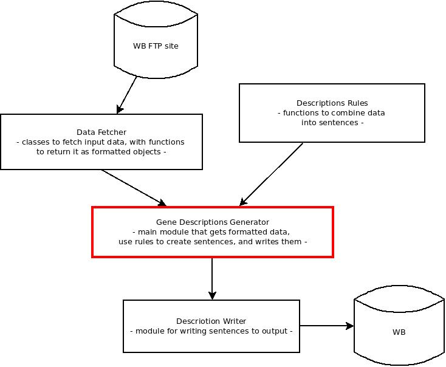

.. wb_genedescriptions documentation master file, created by
   sphinx-quickstart on Wed Jan 31 10:46:54 2018.
   You can adapt this file completely to your liking, but it should at least
   contain the root `toctree` directive.

Welcome to wb_genedescriptions's documentation!
===============================================

This program generates gene descriptions for `WormBase <http://wormbase.org>`_.

The main program, `generate_descriptions.py <generate_descriptions.html>`_, combines the functions of three sub-modules to
get the raw data from WormBase and generate the gene descriptions. The following diagram shows the work flow of the
project.

Each rectangle in the diagram corresponds to a sub-module, documented in the following.

.. toctree::
   :maxdepth: 2
   :caption: Contents:

   data_fetcher
   descriptions_rules
   generate_descriptions

Indices and tables
==================

* :ref:`genindex`
* :ref:`modindex`
* :ref:`search`
